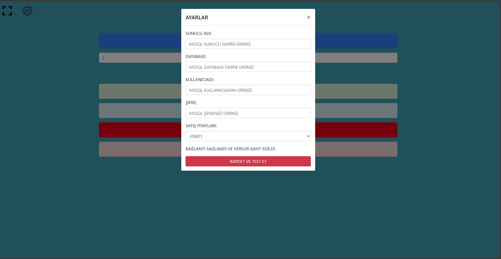

<h1 align="center">PHP-FİYAT_GÖR</h1>

  

  

  Proje Açıklaması

## 🚀 Başlangıç

Bu proje ile SQL'e veri taşıyabilirsiniz.

### 🛠️ Gereksinimler

Aşağıdaki yazılımların yüklü olması gerekmektedir:

- Apache server
- MSSQL

### 📥 Kurulum

1. Bu repository'i klonlayın veya indirin 
2. cd PHP-FIYAT_GOR 
3. Bu Proje Kullanımı için apache serve kurulu olması gerekmektedir.  
4. Projeyi apache server üzüerinden çaştırdıktan sonra ayarlar ⚙️ ikonuna tıklayın ve mssql sunucu ve parametre ayarlarını  yapın.  
5.Barkod okutma işlemi yapabilirsiniz. 

📝 Lisans
Bu proje MIT lisansı altında lisanslanmıştır. Daha fazla bilgi için LICENSE dosyasına bakabilirsiniz.

